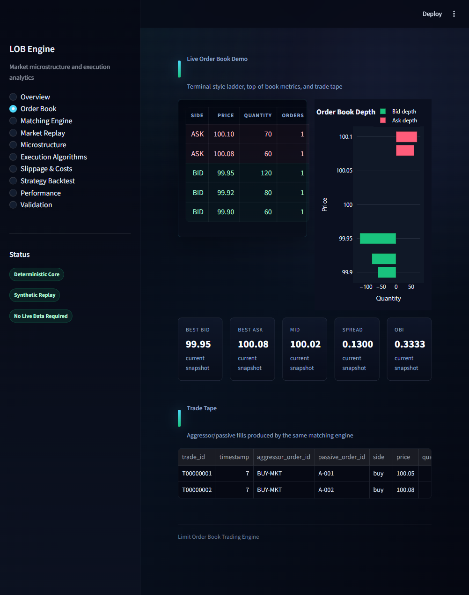
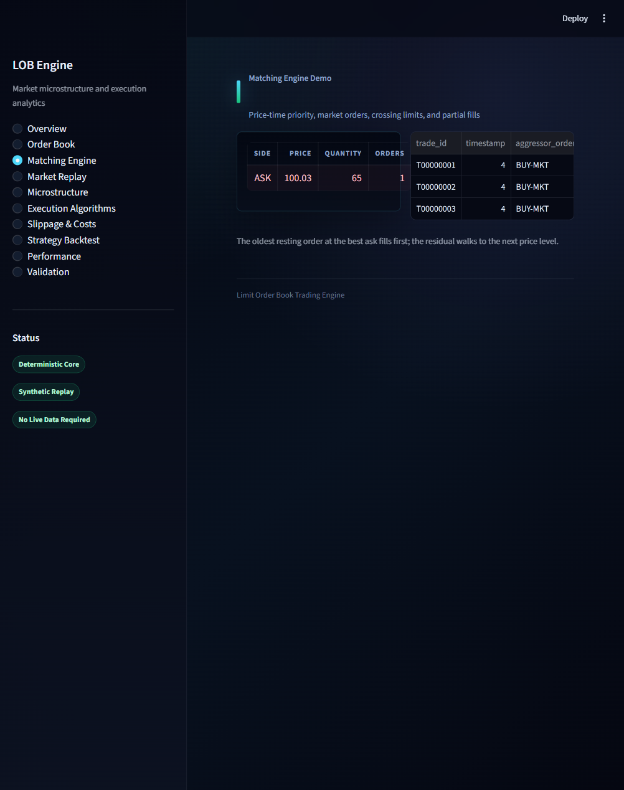
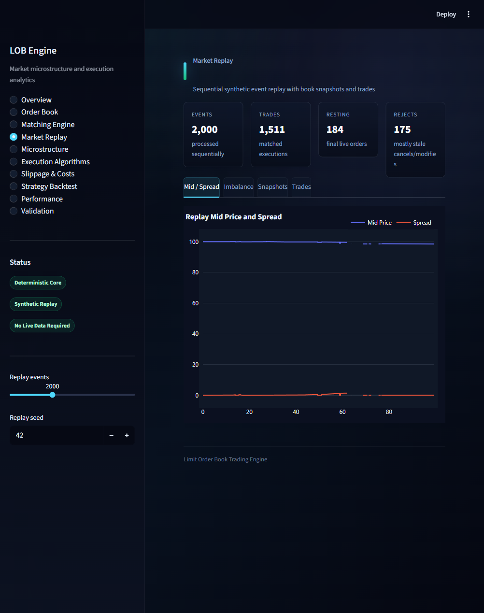
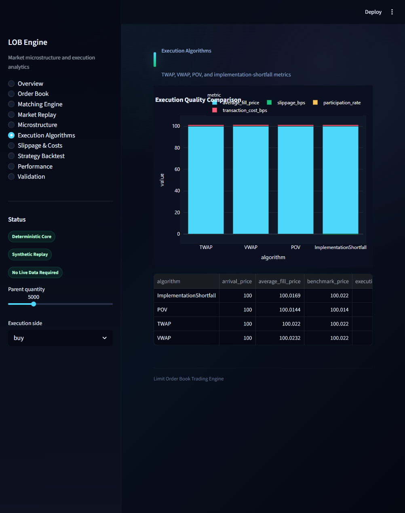
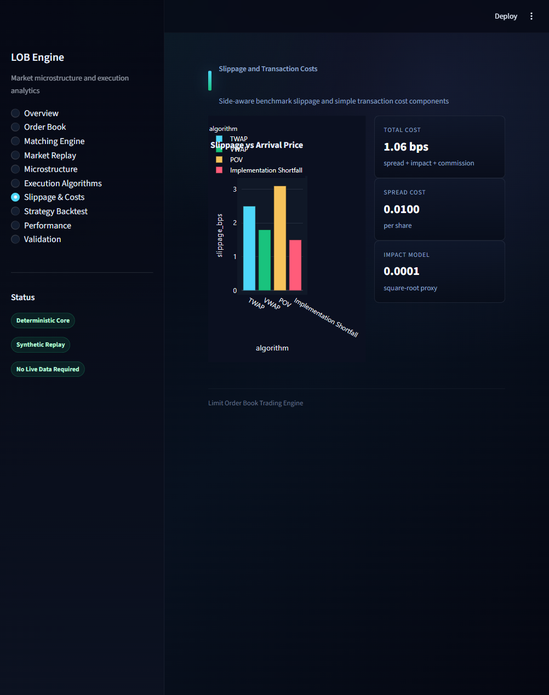
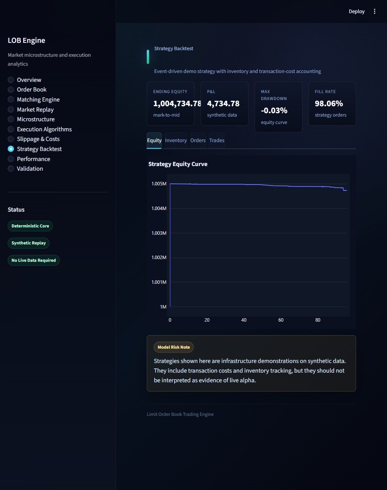
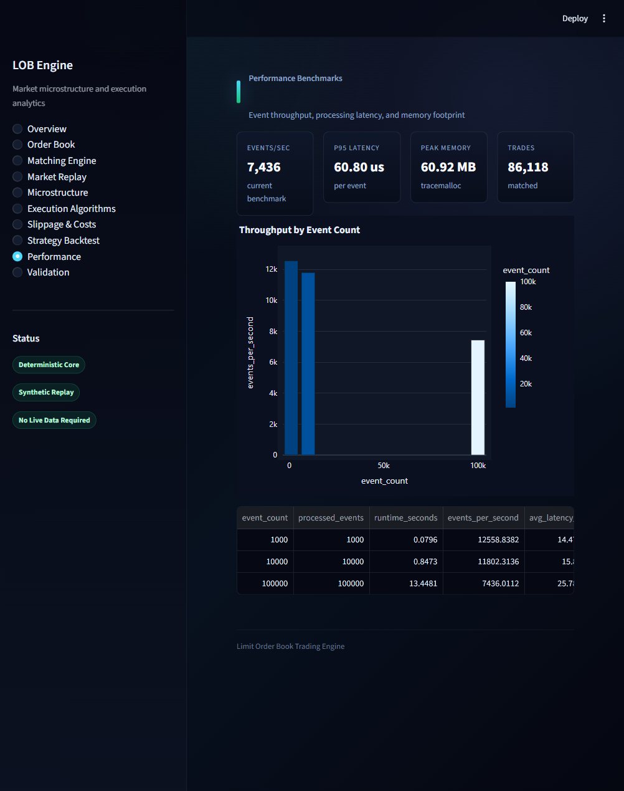

*work in progress*

# Limit Order Book Trading Engine

[](https://www.python.org/)
[](tests/)
[](https://docs.astral.sh/ruff/)
[](https://black.readthedocs.io/)
[](app/streamlit_app.py)
[](LICENSE)

Event-driven limit order book and execution simulator implementing price-time priority matching, market replay, TWAP/VWAP/POV execution algorithms, slippage analytics, transaction cost analysis, strategy backtesting, validation checks, performance benchmarks, and a polished Streamlit dashboard.

## What This Project Demonstrates

- Deterministic price-time priority matching with market, limit, cancel, and cancel/replace request handling.
- FIFO price-level queues, partial fills, order lifecycle tracking, maker/taker trade records, and full book snapshots.
- Market microstructure analytics: best bid/ask, spread, midpoint, depth, imbalance, weighted midpoint, book pressure, rolling volatility, and order-flow imbalance.
- Synthetic market event generation with volatility regimes, liquidity regimes, cancellations, and reproducible seeds.
- Market replay without lookahead, including snapshots, trades, rejections, and time-series analytics.
- Execution algorithms for large parent orders: TWAP, VWAP, POV, and implementation shortfall.
- Transaction cost analytics covering arrival-price slippage, benchmark slippage, spread cost, impact, commission, and total cost in basis points.
- Event-driven strategy backtesting with inventory, cash, P&L, drawdown, turnover, fill-rate, and transaction-cost accounting.
- Performance benchmarking across 1,000, 10,000, and 100,000 synthetic events.

## Why It Matters For Quant Trading

Market microstructure and execution systems sit close to the trading venue: order priority, queue position, liquidity, fill quality, and implementation shortfall directly affect realised performance. This project focuses on those mechanics rather than alpha claims, making it suitable for quant developer, execution trading, market microstructure, systematic trading infrastructure, and trading analytics discussions.

## Headline Validation Results

Latest validation run: **12/12 deterministic checks passed**.

| Area | Result |
| --- | --- |
| Price-time priority | Passed |
| Price priority | Passed |
| Market order matching | Passed |
| Limit order crossing | Passed |
| Partial fills | Passed |
| Cancel handling | Passed |
| Book metrics | Passed |
| Replay determinism | Passed |
| Execution algorithms | Passed |
| Transaction cost analytics | Passed |
| Backtester sanity checks | Passed |
| Performance benchmark execution | Passed |

Full report: [reports/validation_report.md](reports/validation_report.md)

## Performance Benchmark Summary

Benchmarks use deterministic synthetic events and measure matching-engine event processing on the current machine. Results depend on hardware, Python version, operating system, and load.

| Events | Runtime (s) | Events/sec | Avg latency (us) | p95 latency (us) | Peak memory (MB) |
| ---: | ---: | ---: | ---: | ---: | ---: |
| 1,000 | 0.091 | 11,022 | 16.24 | 36.71 | 0.64 |
| 10,000 | 0.843 | 11,869 | 15.89 | 37.00 | 6.13 |
| 100,000 | 8.696 | 11,500 | 17.04 | 39.70 | 60.92 |

Full results: [reports/benchmark_results.csv](reports/benchmark_results.csv) and [reports/performance_report.md](reports/performance_report.md)

## Dashboard Screenshots

The Streamlit dashboard is designed as a premium dark trading analytics interface with custom styling, terminal-style ladder views, dark Plotly charts, metric cards, status badges, and page-like sections.

| Section | Screenshot path |
| --- | --- |
| Order book ladder | `docs/images/order_book_ladder.png` |
| Matching engine demo | `docs/images/matching_engine_demo.png` |
| Market replay | `docs/images/market_replay.png` |
| Execution algorithms | `docs/images/execution_algorithms.png` |
| Slippage analysis | `docs/images/slippage_analysis.png` |
| Strategy backtest | `docs/images/strategy_backtest.png` |
| Performance benchmark | `docs/images/performance_benchmark.png` |









If these images are absent after a clean checkout, see [docs/images/README.md](docs/images/README.md) for the refresh checklist.

## Architecture

```text
src/lob_engine/
├── core/          # orders, events, book, matching engine, deterministic clock
├── analytics/     # microstructure, liquidity, slippage, transaction costs
├── execution/     # TWAP, VWAP, POV, implementation shortfall
├── simulation/    # synthetic generator, replay, fill simulator, backtester
├── strategies/    # market making, mean reversion, momentum examples
└── utils/         # validation, performance, plotting, I/O
```

## Module Map

| Module | Purpose |
| --- | --- |
| `lob_engine.core.orders` | Validated order, cancel, and modify/replace request models |
| `lob_engine.core.order_book` | Bid/ask books, FIFO levels, snapshots, depth, cancellation |
| `lob_engine.core.matching_engine` | Price-time priority matching and trade records |
| `lob_engine.simulation.market_generator` | Reproducible synthetic market events |
| `lob_engine.simulation.market_replay` | Sequential event replay without lookahead |
| `lob_engine.execution` | Parent-order slicing and execution summaries |
| `lob_engine.analytics` | Microstructure, slippage, and transaction cost metrics |
| `lob_engine.simulation.backtester` | Strategy loop with cash, inventory, P&L, and fills |
| `lob_engine.utils.validation` | Deterministic validation report generation |
| `app/streamlit_app.py` | Dashboard and visual analytics interface |

## Installation

```bash
git clone https://github.com/husaam-atq/limit-order-book-trading-engine.git
cd limit-order-book-trading-engine
python -m venv .venv
source .venv/bin/activate  # Windows: .venv\\Scripts\\activate
python -m pip install --upgrade pip
python -m pip install -e ".[dev]"
```

## Run Tests

```bash
python -m compileall src app examples
python -m pytest -v
python -m ruff check .
python -m black --check .
```

## Run Validation And Benchmarks

```bash
python examples/generate_validation_report.py
```

This writes:

- [reports/validation_report.md](reports/validation_report.md)
- [reports/benchmark_results.csv](reports/benchmark_results.csv)
- [reports/performance_report.md](reports/performance_report.md)
- [reports/execution_results.csv](reports/execution_results.csv)
- [data/sample_market_events.csv](data/sample_market_events.csv)
- [data/sample_execution_schedule.csv](data/sample_execution_schedule.csv)

## Run The Dashboard

```bash
streamlit run app/streamlit_app.py
```

Dashboard sections:

- Project overview
- Live order book demo
- Matching engine demo
- Market replay
- Microstructure analytics
- Execution algorithms comparison
- Slippage and transaction cost analysis
- Strategy backtest
- Performance benchmarks
- Validation results

## Example Usage

```python
from lob_engine.core.matching_engine import MatchingEngine
from lob_engine.core.orders import Order, OrderType, Side

engine = MatchingEngine()
engine.process_order(Order("ASK-1", Side.SELL, OrderType.LIMIT, 100, 100.05, timestamp=1))
result = engine.process_order(Order("BUY-1", Side.BUY, OrderType.MARKET, 40, timestamp=2))

print(result.trades[0].price, result.trades[0].quantity)
print(engine.book.top_n_levels(5))
```

More examples:

```bash
python examples/run_order_book_demo.py
python examples/run_matching_engine_demo.py
python examples/run_execution_algorithms.py
python examples/run_market_replay.py
python examples/run_strategy_backtest.py
```

## Notebooks

| Notebook | Focus |
| --- | --- |
| `01_order_book_basics.ipynb` | Book structure, depth, cancellation, snapshots |
| `02_matching_engine_validation.ipynb` | Priority rules, market orders, crossing limits, partial fills |
| `03_execution_algorithms.ipynb` | TWAP, VWAP, POV, implementation shortfall comparison |
| `04_market_replay_and_slippage.ipynb` | Synthetic replay, microstructure time series, fill simulation |

Execute from the repository root:

```bash
python -m jupyter nbconvert --to notebook --execute notebooks/01_order_book_basics.ipynb --output executed_01_order_book_basics.ipynb
python -m jupyter nbconvert --to notebook --execute notebooks/02_matching_engine_validation.ipynb --output executed_02_matching_engine_validation.ipynb
python -m jupyter nbconvert --to notebook --execute notebooks/03_execution_algorithms.ipynb --output executed_03_execution_algorithms.ipynb
python -m jupyter nbconvert --to notebook --execute notebooks/04_market_replay_and_slippage.ipynb --output executed_04_market_replay_and_slippage.ipynb
```

## Results And Interpretation

The validation suite targets deterministic matching-engine correctness and reproducible replay behaviour. The synthetic strategy examples are included to demonstrate infrastructure, accounting, and analytics workflows. They do not imply live profitability and should not be interpreted as alpha research.

Performance results show that the pure-Python implementation can process sizeable synthetic event streams on a modern workstation. The code favours clarity, deterministic validation, and modular design over exchange-grade low-latency engineering.

## Limitations

- Synthetic events are not a substitute for full-depth historical exchange data.
- Queue position, hidden liquidity, auctions, order amendments, self-trade prevention, and exchange-specific edge cases are simplified.
- The backtesting layer is intentionally compact and designed for infrastructure demonstration.
- Benchmark results are machine-specific and should be regenerated on the target environment.
- Strategies are simple examples and not trading recommendations.

## Future Improvements

- Add sorted price maps or tree-backed price levels for larger book sizes.
- Add exchange-specific order types, tick-size tables, and session calendars.
- Add historical data adapters for public LOBSTER-style or exchange sample datasets.
- Extend fill models with queue position and adverse selection.
- Add optional Numba acceleration for replay and analytics hot paths while retaining a pure-Python path.
- Add richer transaction cost calibration from empirical spreads and volatility.


## Purpose

This repository is intended to show practical trading systems engineering: clean models, deterministic matching rules, reproducible validation, testing discipline, execution analytics, benchmark reporting, and a dashboard suitable for explaining the system visually.
